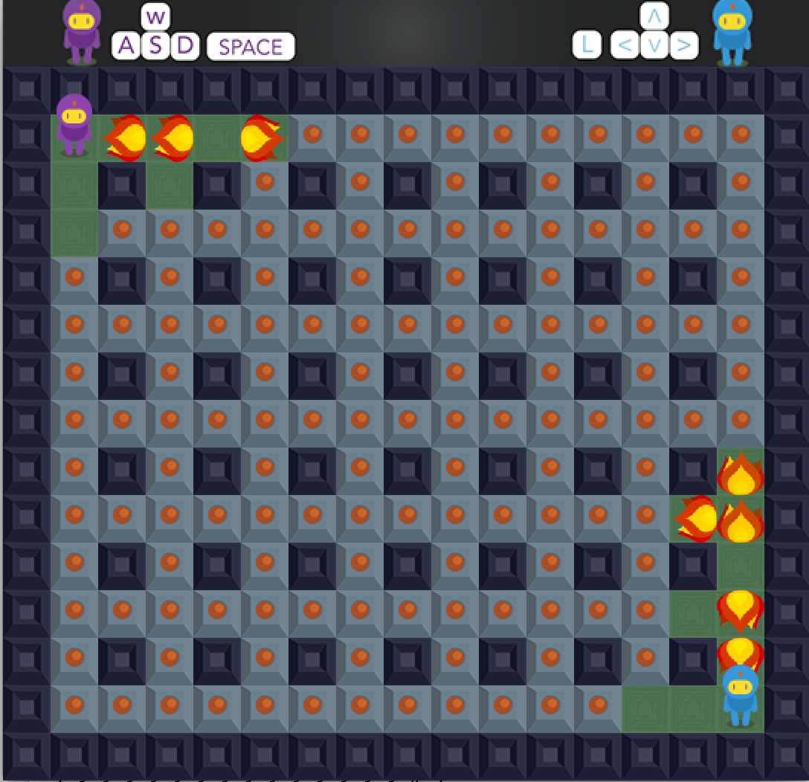

# Bomberman

* English Documention Coming.

## Bomberman ’da Kullanılan Nesneler

* Kırılamayan Duvarlar

* Kırılabilen Duvarlar

* Bomba

* Bomba Alevleri

* Oyuncular

## Oyunun Yapılış Amacı 
* Nostaljik Bomberman oyununun her bilgisayarda çalışmasını ve 2 kişinin eğlenceli vakit geçirmesini sağlamak.

## Oyunun İşleyişi;

Oyun panelin açılması ile mor oyuncu sol üst köşe ,mavi oyuncu sağ alt köşede olmak üzere çevresinde ve içinde belirli yerlerde kırılamayan duvarlarla kaplı diğer kalan kısmın ise bombalar ile kırılabilir duvarların olduğu bir haritada başlarlar. Panelin üst kısmında ise oyuncu klavye kontrolleri gösterilmektedir. Oyuncular klavyeden belirlenen tuşlar ile oyuncuyu kontrol eder. Oyuncular duvarları patlatarak rakip oyuncuya ulaşıp rakibi bombayla öldürmeyi hedef alır.Rakibini ilk öldüren oyuncunun kazanmasıyla oyun sona erer.

## Class Hiyerarşisi

* Entity.java sınıfından;

* Player.java,

* Bomb.java[ActionListener‘ı -> İmplement ediyor]

* Flame.java [ActionListener’ı ->İmplement ediyor]

* Walls.java

* Extends ediliyor.

* Walls.java sınıfından; 

* FragileWall.java 

* NonFragileWall.java 

Extends ediliyor.

Board.java sınıfı

 [ActionListener.java -> implement ediyor] içerisinde nesneleri kullanabilmek için JPanel.java sınıfını extends ediyor.Board.java sınıfında, haritanın çizilmesi,oyuncuların çizilmesi,resimler,oyuncuların tuşlar ile kontrolü,arkaplan sesleri ve diğer sesler,bomba yerleştirme ve yerleştirilen bombanın alevlerinin gösterilmesi bu sınıfta gerçekleştirilmektedir.

MultiKeyPressListener.java sınıfı

[KeyListener.java  ->implement ediyor.]
Oyuncuları kontrol eden tuşlara aynı anda basıldığından diğer oyuncunun hareketini elgellemesinin önüne geçmek için kullanılan bir sınıftır.

Application.java sınıfı 

Bu sınıf form ekranını oluşturmamızı sağlayan JFrame.java sınıfını extends ediyor.
Aynı zamanda oluşturulan form ekranın boyut,başlık,büyütülemeyen ekran(Resizable),konum gibi özelliklerini belirttiğimiz main metodudur.

NOT:Projemizde toplam 12  adet sınıf kullanılmıştır.

## Projemizde Kullanılan Yapılar Ve Özellikler

* İmplement

* Extend

* JPanel

* JFrame

* Kapsülleme

* Enum

* Timer

* Graphics metotları

* Override

## Ekran Görüntüleri

  

